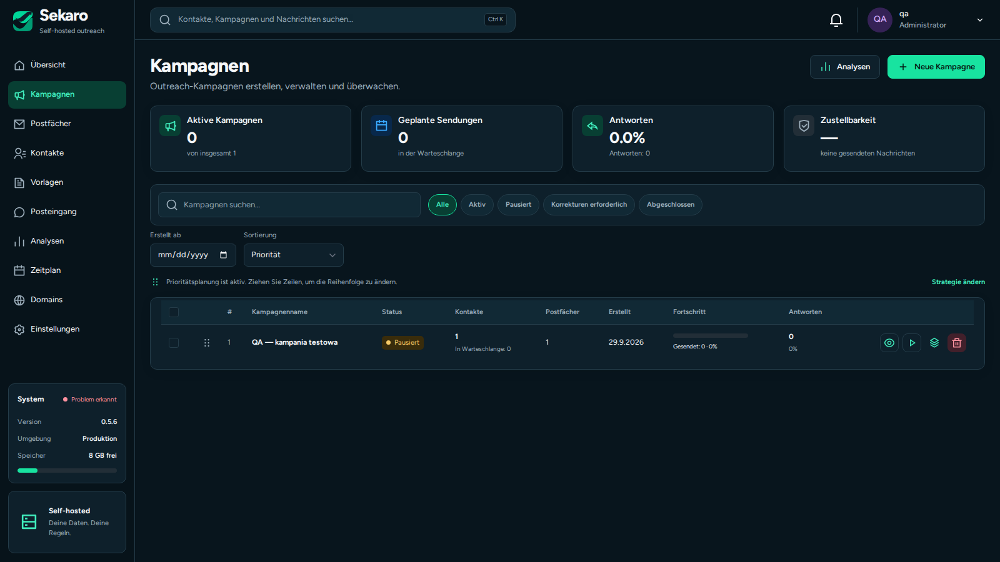

<p align="center"></p>
<h1 align="center">Sekaro</h1>
<p align="center"><strong>Kontakty. Sprzedaż. Korespondencja. Pod Twoją kontrolą.</strong></p>
<p align="center">Self-hosted CRM & outreach · FastAPI · React · PostgreSQL</p>
<p align="center"><a href="docs/INSTALLATION.md">Instalacja</a> · <a href="docs/BACKUPS.md">Backup i odtwarzanie</a> · <a href="docs/STAGE_11_RELEASE.md">Stan wydania</a> · <a href="docs/RELEASE_EXECUTION_PLAN.md">Plan prac</a></p>

Sekaro łączy bazę kontaktów, proces sprzedaży i pocztę w jednej aplikacji na Twoim serwerze. Kontakt zachowuje historię od pierwszej wiadomości po szansę sprzedaży, zadanie i spotkanie. SMTP/IMAP działa niezależnie od Google i Microsoft; ich adaptery OAuth są opcjonalne.

> **Linia rozwojowa — pakiet 11 do odbioru.** Kod zawiera instalator i zdalne backupy, ale pełny odbiór wizualny oraz próby instalacji i transferów na rzeczywistych usługach pozostają bramką wydania. Nie oznaczamy tego jeszcze jako stabilne 1.0. Szczegóły: [stan i ograniczenia](docs/STAGE_11_RELEASE.md).

## Co mieści się w Sekaro

| Obszar | Możliwości |
|---|---|
| Kontakty i firmy | Import CSV/XLSX, pola własne, wiele adresów, relacje, grupy, archiwum, scalanie i trwała historia operacji |
| Sprzedaż | Pipeline, szanse, zadania, spotkania i kalendarz CRM; szczegóły wydarzenia przed osobną edycją |
| Kampanie | Sekwencje, personalizacja, podgląd, limity skrzynek, harmonogram, preflight i jawne uruchamianie kampanii |
| Korespondencja | Wspólna skrzynka, SMTP/IMAP, opcjonalne Gmail API i Microsoft Graph |
| Tożsamość nadawcy | Opcjonalna stopka i osobisty certyfikat S/MIME per skrzynka — bez obowiązku dla pozostałych użytkowników |
| Kontrola | Role, zespoły i uprawnienia API, audyt, suppression, zatrzymanie po odpowiedzi i wypisaniu |
| Utrzymanie | Instalator, diagnostyka, lokalne kopie, opcjonalne S3/SFTP/FTPS, szyfrowanie i historia transferów |
| Interfejs | Polski, English, Deutsch, Русский; jasny i ciemny motyw |

**S/MIME podpisuje wiadomość, ale nie gwarantuje dostarczenia do inboxa.** SPF, DKIM, DMARC, reputacja i zgody odbiorców nadal wymagają osobnej konfiguracji. [Poczta i certyfikaty →](docs/STAGE_10_MAIL.md)

## Podgląd interfejsu



*Rzeczywisty zrzut interfejsu z izolowanego QA, 30.09.2026, język DE i dane testowe. Pokazuje wcześniejszy widok kampanii; nie jest dowodem odbioru pakietu 11.*

## Start na własnym serwerze

Wymagania: Git, Python 3.10+, działający Docker Engine z Compose v2, dostęp do repozytorium i rejestrów obrazów. Skrypt nie instaluje Dockera ani nie zmienia reguł zapory.

```bash
git clone https://github.com/Lipskus/Sekaro.git
cd Sekaro
# Wybierz zatwierdzony commit wydania — nie zakładaj, że main zawiera pakiet 11.
git switch --detach <commit-wydania>
python3 scripts/sekaro-install.py check
python3 scripts/sekaro-install.py install
```

Aplikacja nasłuchuje na `127.0.0.1:5050`. Otwórz ją przez zaufany tunel lub reverse proxy HTTPS i utwórz pierwszego administratora. Instalator generuje sekrety tylko raz; przechowuj `.env` w bezpiecznej kopii poza serwerem. **Nie usuwaj konfiguracji istniejącej instalacji, aby wymusić instalację od nowa.**

[Pełna instrukcja instalacji, aktualizacji i diagnostyki →](docs/INSTALLATION.md)

## Aktualizacja istniejącego demo lub produkcji

```bash
cd /opt/sekaro
# Najpierw pobierz i wybierz dokładny commit uzgodnionego wydania.
python3 scripts/sekaro-install.py update
python3 scripts/sekaro-install.py status
```

Aktualizator rozpoznaje `.sekaro-demo/env`, zachowuje override PostgreSQL 17, tworzy lokalny dump przed zmianą aplikacji, buduje obraz z etykietą commitu i weryfikuje uruchomioną rewizję. Nie podnosi automatycznie głównej wersji istniejącego PostgreSQL. Samo `sekaro-demo.sh up` nadal **nie buduje** obrazu.

## Kopie, które można odzyskać

W **Ustawienia → Backup / przywracanie** skonfiguruj szyfrowanie i harmonogram. Opcjonalnie dodaj jeden cel: S3 (także kompatybilny endpoint HTTPS), SFTP z przypiętym kluczem hosta albo FTPS z TLS. Zwykły FTP nie jest obsługiwany.

Zdalna kopia jest szyfrowana przed wysłaniem. Po transferze aplikacja odczytuje plik ponownie i porównuje SHA-256; dopiero potem uruchamia retencję. Nieudane transfery pozostawiają lokalny plik. Pobranie kopii do formularza nie przywraca bazy — nadal wymagany jest podgląd i oddzielne potwierdzenie.

[Konfiguracja, ograniczenia, klucze i procedura odtwarzania →](docs/BACKUPS.md)

## Dokumentacja

- [Instalacja i aktualizacja](docs/INSTALLATION.md)
- [Backup, S3, SFTP, FTPS i odtwarzanie](docs/BACKUPS.md)
- [Uprawnienia i użytkownicy](docs/STAGE_8_ACCESS.md)
- [Gmail API](docs/STAGE_9_GMAIL.md)
- [Microsoft 365, stopki i S/MIME](docs/STAGE_10_MAIL.md)
- [Zakres testów i otwarte bramki pakietu 11](docs/STAGE_11_RELEASE.md)
- [Uzgodniony plan wykonania](docs/RELEASE_EXECUTION_PLAN.md)

Panel administracyjny powinien pozostać prywatny. Oddzielna usługa wypisywania odbiorców ma własny profil Compose i ograniczoną rolę bazy; nie wystawiaj całego panelu tylko po to, aby działały linki rezygnacji.

## Licencja

Sekaro jest udostępniane na licencji **MIT**. Warunki i wymagane oznaczenia praw autorskich znajdują się w [LICENSE](LICENSE), a informacje o wykorzystanym kodzie w [THIRD_PARTY_NOTICES.md](THIRD_PARTY_NOTICES.md).
