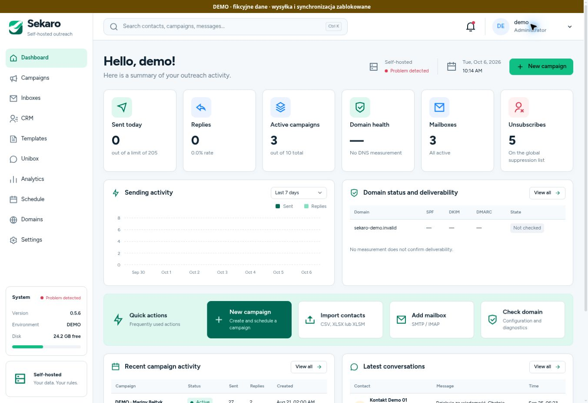
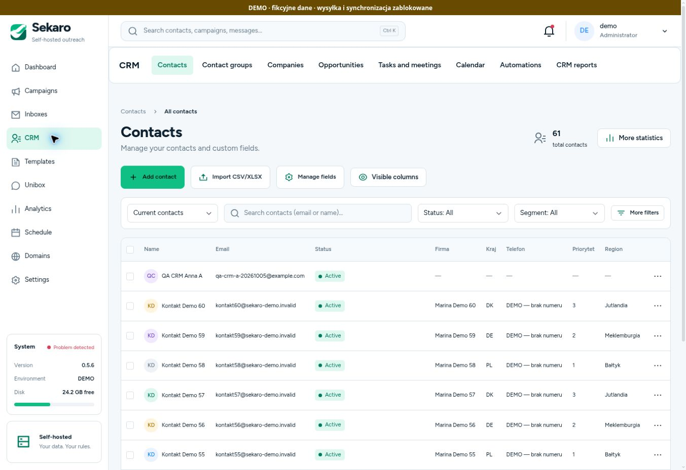

<p align="center"></p>
<h1 align="center">Sekaro</h1>
<p align="center"><strong>Contacts. Sales. Conversations. Under your control.</strong></p>
<p align="center">Self-hosted CRM & outreach · FastAPI · React · PostgreSQL</p>
<p align="center"><a href="docs/INSTALLATION.md">Installation</a> · <a href="docs/BACKUPS.md">Backup & recovery</a> · <a href="docs/STAGE_11_RELEASE.md">Release status</a> · <a href="docs/README.md">Documentation</a></p>

Sekaro brings contacts, sales workflows and email into one application on your own server. Keep a contact's history from the first message through opportunities, tasks and meetings. SMTP/IMAP works independently of Google and Microsoft; their OAuth adapters are optional.

> **Development release — stage 11 awaiting acceptance.** The installer and remote backups are included in `main`. Full visual acceptance and installation/provider trials remain release gates. This is not yet a stable 1.0 release. See [release status and limitations](docs/STAGE_11_RELEASE.md).

## What you can do

| Area | Capabilities |
|---|---|
| Contacts & companies | CSV/XLSX import, custom fields, multiple addresses, relationships, groups, archiving, merging and durable operation history |
| Sales | Pipeline, opportunities, tasks, meetings and a CRM calendar; view event details before choosing to edit |
| Campaigns | Sequences, personalization, previews, mailbox limits, scheduling, preflight checks and explicit campaign activation |
| Email | Unified inbox, SMTP/IMAP, optional Gmail API and Microsoft Graph |
| Sender identity | Optional email footer and personal S/MIME certificate for each mailbox |
| Access & safety | Roles, teams, API permissions, audit history, suppression and stopping after replies or unsubscribes |
| Operations | Installer, diagnostics, local backups, optional S3/SFTP/FTPS, encryption and transfer history |
| Interface | English, Polish, German and Russian; light and dark themes |

**S/MIME signs messages; it does not guarantee inbox placement.** SPF, DKIM, DMARC, sender reputation and recipient consent remain separate requirements. [Email and certificates →](docs/STAGE_10_MAIL.md)

## Interface preview





*Real demo captures, 6 October 2026, with English selected. The deployment banner and existing sample records retain their original Polish text. These screenshots show the deployed demo, not proof of complete stage 11 acceptance. [Capture details](docs/screenshots/README.md).*

## Run on your own server

Requirements: Git, Python 3.10+, Docker Engine with Compose v2, and access to the repository and image registries. The installer does not install Docker or change firewall rules.

```bash
git clone https://github.com/Lipskus/Sekaro.git
cd Sekaro
# Replace the placeholder with the exact approved release commit.
git switch --detach <release-commit>
python3 scripts/sekaro-install.py check
python3 scripts/sekaro-install.py install
```

The application binds to `127.0.0.1:5050`. Access it through a trusted tunnel or HTTPS reverse proxy and create the first administrator. Secrets are generated only once; keep a secure off-server copy of `.env`. **Do not delete an existing installation's configuration to force a fresh install.**

[Installation, updates and troubleshooting →](docs/INSTALLATION.md)

## Update an existing demo or production installation

```bash
cd /opt/sekaro
# Fetch and select the exact approved release commit first.
python3 scripts/sekaro-install.py update
python3 scripts/sekaro-install.py status
```

The updater detects `.sekaro-demo/env`, preserves the PostgreSQL 17 override, creates a local database dump before replacing the application, builds an image labelled with the commit and verifies the running revision. It does not automatically upgrade an existing PostgreSQL major version. Running `sekaro-demo.sh up` alone still **does not build** the image.

## Backups you can recover

Configure encryption and scheduling in the backup settings. Optionally add one remote destination: S3 (including a compatible HTTPS endpoint), SFTP with a pinned host key, or explicit FTPS with TLS. Plain FTP is not supported.

Remote backups are encrypted before upload. Sekaro downloads each uploaded file again and compares SHA-256 before applying retention. Failed transfers keep the local pending file. Loading a backup into the restore form only downloads it; preview and separate confirmation are still required.

[Configuration, limits, keys and recovery procedures →](docs/BACKUPS.md)

## Documentation

- [Documentation index](docs/README.md)
- [Installation and updates](docs/INSTALLATION.md)
- [Backup, S3, SFTP, FTPS and recovery](docs/BACKUPS.md)
- [Users, roles and permissions](docs/STAGE_8_ACCESS.md)
- [Gmail API](docs/STAGE_9_GMAIL.md)
- [Microsoft 365, footers and S/MIME](docs/STAGE_10_MAIL.md)
- [Release validation and remaining gates](docs/STAGE_11_RELEASE.md)
- [Agreed delivery plan](docs/RELEASE_EXECUTION_PLAN.md)

Keep the administration panel private. The isolated unsubscribe service has its own Compose profile and restricted database role; do not expose the entire panel to make unsubscribe links work.

## License

Sekaro is available under the **MIT License**. Terms and required copyright notices are in [LICENSE](LICENSE); incorporated-code notices are in [THIRD_PARTY_NOTICES.md](THIRD_PARTY_NOTICES.md).
